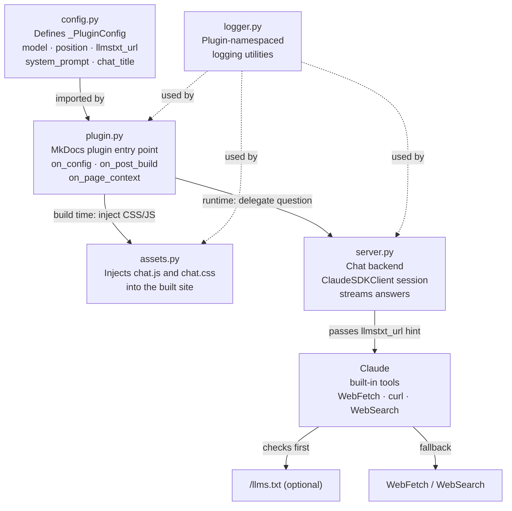
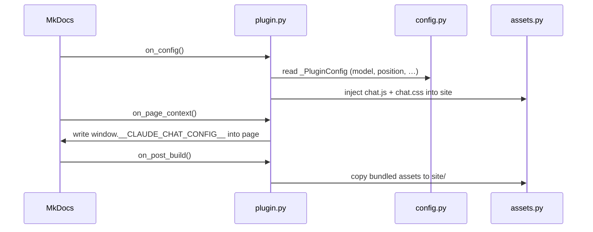
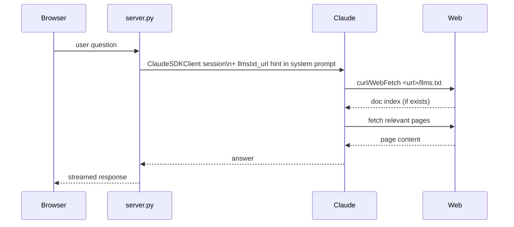

# Architecture

This page describes how the internal modules of `mkdocs-claude-chat` collaborate.

## Module Collaboration

## Build-time Flow

When `mkdocs build` runs:

## Chat Runtime Flow

When a visitor asks a question in the widget:

## Implementation Status

| Module | Status | Notes |
|---|---|---|
| `config.py` | Done | Full config schema |
| `plugin.py` | Partial | Class declared, hooks not implemented |
| `assets.py` | Stub | Empty |
| `server.py` | Stub | Empty |
| `logger.py` | Stub | Empty |
