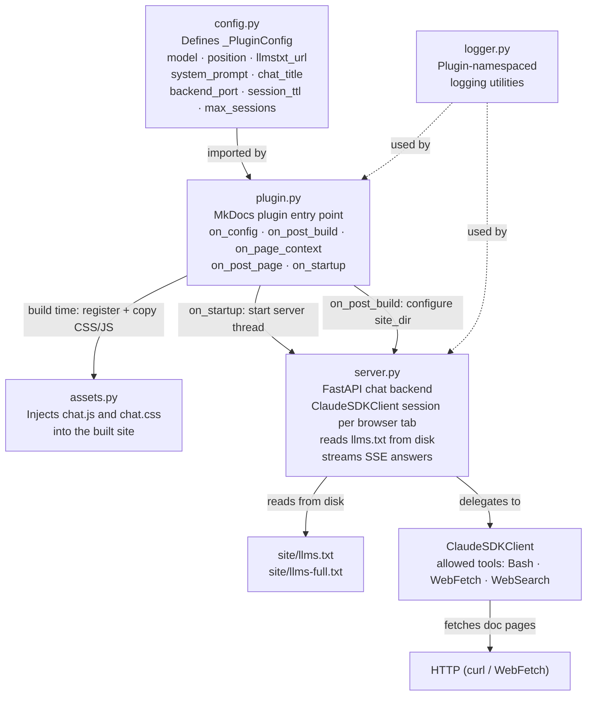
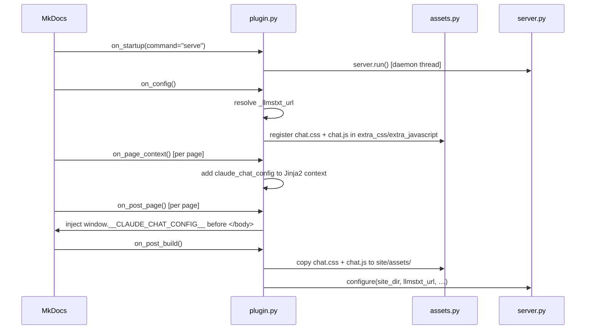
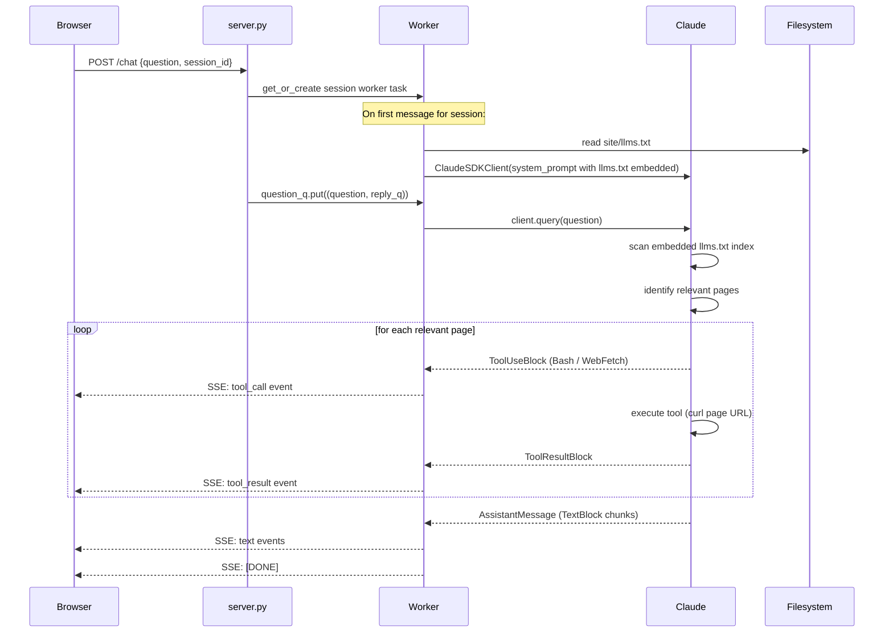
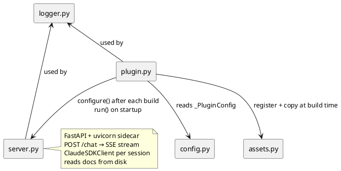

# Architecture

This page describes how the internal modules of `mkdocs-ask-claude` collaborate.

## Module Collaboration

## Build-time Flow

When `mkdocs build` or `mkdocs serve` runs:

## Chat Runtime Flow

When a visitor asks a question in the widget:

## Module Dependencies

## Implementation Status

| Module | Status | Notes |
|---|---|---|
| `config.py` | Done | Full config schema: enabled, model, system_prompt, llmstxt_url, chat_title, position, backend_port, session_ttl, max_sessions |
| `plugin.py` | Done | on_config, on_post_build, on_page_context, on_post_page, on_startup |
| `assets.py` | Done | CSS/JS registration + copy to site/assets/ |
| `server.py` | Done | FastAPI backend, ClaudeSDKClient sessions, SSE streaming, session TTL + eviction |
| `logger.py` | Done | Plugin-namespaced logging adapter (mkdocs.plugins.ask-claude.*) |
| `tools.py` | Stub | Reserved for custom Claude tool definitions |
